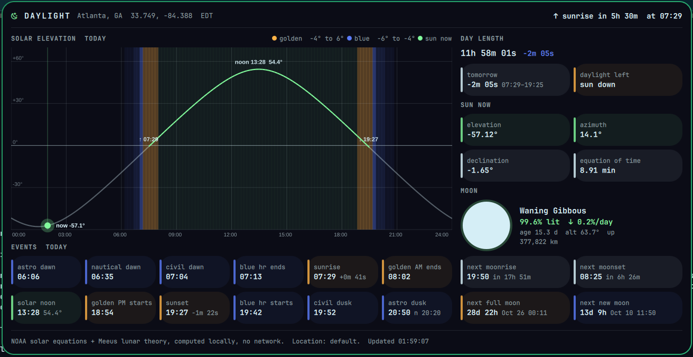

# Daylight for Omarchy

A sun and moon ephemeris for the Omarchy bar. Everything is computed locally with the NOAA solar equations and Meeus lunar theory. It makes no network calls and needs only the python3 stdlib, with no bun and no pip.



**Bar:** a sun or moon glyph, plus the countdown to the next sunrise (↑) or sunset (↓). Hover it for elevation and moon illumination.


**Panel** (fits on one screen with no scrolling):
- **Solar elevation arc** for the whole local day, with the sun's position now. Bands mark golden hour (-4° to 6°), blue hour (-6° to -4°) and the civil, nautical and astronomical twilights.
- **12 event tiles:** astro/nautical/civil dawn, blue hour end, sunrise (with its shift vs yesterday), golden hour end, solar noon (with peak elevation), golden hour start, sunset, blue hour start, civil dusk, and astro and nautical dusk.
- **Day length** and its change vs yesterday and tomorrow, plus how much daylight is left.
- **Sun now:** elevation (with refraction), azimuth, declination and the equation of time.
- **Moon:** a drawn phase glyph, the phase name, illumination and its daily trend, age, altitude, distance, the next moonrise and moonset, and countdowns to the next full and new moon.

Hover any tile for what it means.

## Accuracy

`tests/test.sh` checks Atlanta on 2026-09-27 against the US Naval Observatory's figures:

| Event | Daylight | USNO |
|---|---|---|
| Sunrise | 07:29 | 07:29 |
| Sunset | 19:27 | 19:27 |
| Civil dawn / dusk | 07:04 / 19:52 | 07:04 / 19:52 |
| Moonrise / moonset | 19:50 / 08:25 | 19:51 / 08:25 |

Next full moon 2026-10-26 00:11 EDT, next new moon 2026-10-10 11:50 EDT (Meeus ch. 49 true phases).

## Install

```bash
git clone https://github.com/nixfred/daylight.omarchy
mkdir -p ~/.config/omarchy/plugins/nixfred.daylight
cp -r daylight.omarchy/{manifest.json,BarWidget.qml,DaylightPanel.qml,bin} ~/.config/omarchy/plugins/nixfred.daylight/
omarchy-shell shell rescanPlugins
omarchy plugin enable nixfred.daylight right
```

## Location

The default location is Atlanta, GA (33.749, -84.388). Either:
- set `lat`, `lon` and `place` in the widget settings (right-click the widget), or
- create `~/.config/daylight/location.json`:

```json
{ "lat": 51.4779, "lon": -0.0015, "place": "Greenwich" }
```

Times display in the system time zone.

## IPC

```bash
omarchy-shell nixfred.daylight toggle   # open | close
omarchy-shell nixfred.daylight json     # the full ephemeris as JSON
python3 bin/daylight.py --lat 40.7 --lon -74.0   # CLI, same JSON
```

## Screenshots

- `docs/panel.png`, `docs/bar.png`: live on gus (5120x1440).
- `docs/test-drive-panel.png`: the Test Drive VM (Omarchy 4.0.2, 1280x800).

## License

MIT
